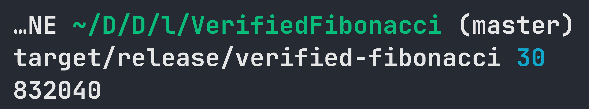

<div align="center">

# Verified Toy Fibonacci CLI

**Verified, toy CLI for calculating the nth Fibonacci number.**

</div>

This is a toy project experimenting with Dafny and the translation to Rust.
The Fibonacci algorithm is verified in Dafny (which of course isn't really a hard thing to do).
The Dafny code is in [`src/main.dfy`](./src/main.dfy).
The verified and to Rust translated code is also checked out in git under the [`translation/main-rust`](./translation/main-rust/) directory.

## Compilation & Verification

### Prerequisites

* [Dafny](https://dafny.org/)
* [Rust](https://rust-lang.org/)
* [Task](https://taskfile.dev/)


### Compilation of Rust Checked out in VCS

To compile the in the VCS checked out Rust code, run:

```
cargo build --release
```

The compiled executable is in `target/release`.


### Compilation from Dafny

To verify, translate and compile the Dafny code, run:

```
task brs
```

The compiled executable is in `target/release`.


### Verification of Dafny Code

To just verify the Dafny code, run:

```
task v
```


## Images




## Note

And by the way at the moment of writing this, the translation of the Dafny standard library to Rust fails for me. That's why I wrote `NatFromString`.

